  

  <h1><code>Stephen</code></h1>
  <h3><code>Fullstack / Go Engineer · VK Education Team Lead 2025 · Yandex Intern · BMSTU 2026</code></h3>

  

    
    
    
  

---

### `~/about`

  

> *"I don't just code — I build systems users love and engineers respect."*

---

### `~/stack`

| Backend | Databases | DevOps | Frontend | Tools |
|---------|-----------|--------|----------|-------|
|    |    |    |    |    |

---

### `~/contributions`

  

Refreshed daily via GitHub Actions.

---
